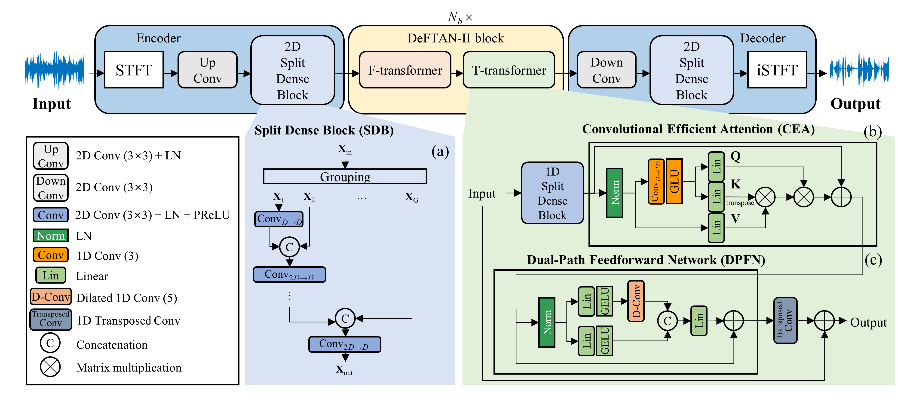

# DeFTAN-II: Efficient multichannel speech enhancement with subgroup processing


[](https://ieeexplore.ieee.org/stamp/stamp.jsp?tp=&arnumber=10738447)
[](https://huggingface.co/donghoney0416/DeFTAN-II)
[](https://donghoney0416.github.io/demos-DeFTAN-II/demo-page.html)

Official implementation of IEEE/ACM Transactions on Audio, Speech, and Language Processing (IEEE/ACM TASLP) 2024 paper **"[DeFTAN-II: Efficient multichannel speech enhancement with subgroup processing](https://arxiv.org/pdf/2308.15777) (accepted)"**.

*In this work, we present DeFTAN-II, an efficient multichannel speech enhancement model based on transformer architecture and subgroup processing. Despite the success of transformers in speech enhancement, they face challenges in capturing local relations, reducing the high computational complexity, and lowering memory usage. To address these limitations, we introduce subgroup processing in our model, combining subgroups of locally emphasized features with other subgroups containing original features. The subgroup processing is implemented in several blocks of the proposed network. In the proposed split dense blocks extracting spatial features, a pair of subgroups is sequentially concatenated and processed by convolution layers to effectively reduce the computational complexity and memory usage. For the F- and T-transformers extracting temporal and spectral relations, we introduce crossattention between subgroups to identify relationships between locally emphasized and non-emphasized features. The dual-path feedforward network then aggregates attended features in terms of the gating of local features processed by dilated convolutions. Through extensive comparisons with state-of-the-art multichannel speech enhancement models, we demonstrate that DeFTAN-II with subgroup processing outperforms existing methods at significantly lower computational complexity. Moreover, we evaluate the model’s generalization capability on real-world data without fine-tuning, which further demonstrates its effectiveness in practical scenarios.*



## 1. Setup
1. Clone repository
```
git clone https://github.com/donghoney0416/DeFTAN-II.git
cd DeFTAN-II
```

2. Install requirements
```
pip install -r requirements.txt
```

## 2. Details
### Dataset
The dataset was simulated using pyroomacoustics. See `generate_rir/gen_rir.py` for an example of the simulation code, and `generate_rir/pyroom_rir.cfg` for the configuration file.

### Model
We released the code so that the model could be trained from scratch, and we uploaded a pre-trained model, trained on the spatialized DNS Challenge dataset, to Hugging Face. 
See `DeFTAN2.py` to adjust the parameters or change modules for custom training.

### Loss
The model was trained using PCM loss and SI-SDR loss; PCM loss was uploaded as the primary loss. See `pcm_loss.py` for details, and feel free to modify it as needed.

### Using pre-traind model [](https://huggingface.co/donghoney0416/DeFTAN-II)
We have uploaded the pre-trained model and instructions for use on Hugging Face. Thank you for exploring and using DeFTAN-II.

## 3. Results and Demos [](https://donghoney0416.github.io/demos-DeFTAN-II/demo-page.html)
We have uploaded more audio clips and spectrogram examples to our demo page. Results from five datasets are provided: the spatialized WSJCAM0 dataset, the spatialized DNS Challenge dataset, the spatialized WSJ0-2mix dataset, the CHiME-3 real dataset, and the EasyCom dataset. This includes sound source separation, real-world speech enhancement, and more. Spectrograms and audio clips can be downloaded directly from the `fig` and `audio` directories, respectively.


## Citations
```
@article{lee2024deftan,
  title={DeFTAN-II: Efficient multichannel speech enhancement with subgroup processing},
  author={Lee, Dongheon and Choi, Jung-Woo},
  journal={IEEE/ACM Transactions on Audio, Speech, and Language Processing},
  year={2024},
  publisher={IEEE}
}
```
